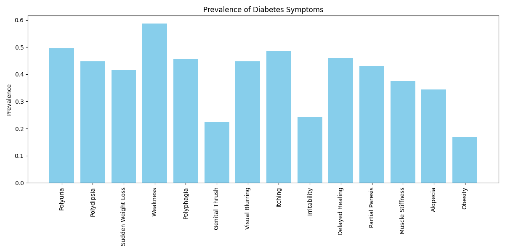
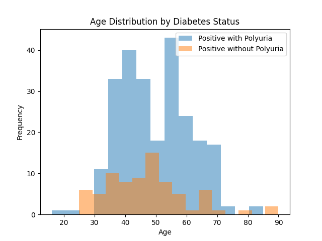
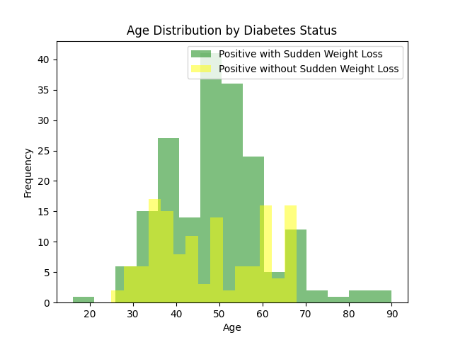
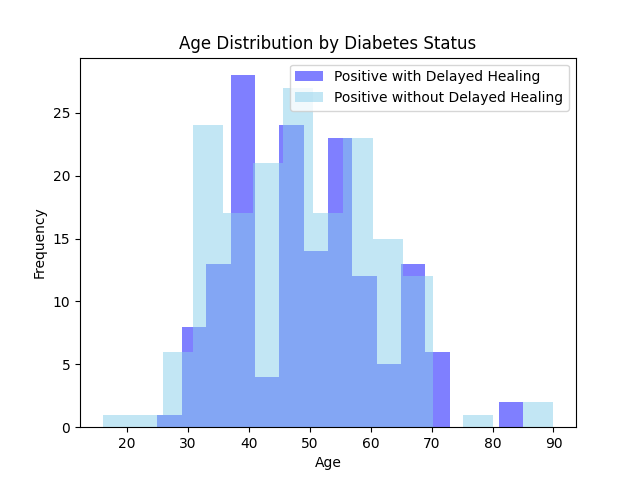
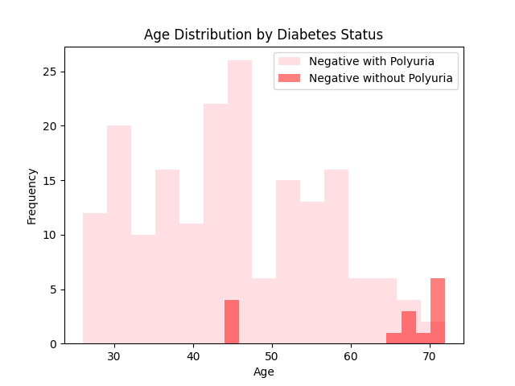
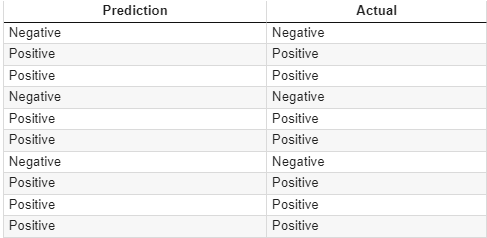
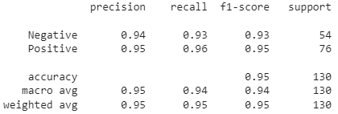

# Columbia University Bootcamp Project 4

<h2>Healthcare - Diabetes Risk Prediction</h2>

  This healthcare related project utilizes machine learning to predict whethere a patient is at risk of diabetes based on various health indicators.

  The predictions made using the model do not replace a true diagnosis made by a healthcare professional.  Predictions made using the model are just to illustrate the skill of developing a machine learning model using responses of patients based on their age, gender, and risk factors.

  The dataset used for the analysis was found using Kaggle.com and is located within the Resources folder of this hub.

  Name of Dataset:  <b>diabetes_risk_prediction_dataset</b>

  <b>Since the notebook of the coding for this project was done through Google Colab, the dataset must be uploaded to the drive within the code file first.</b>

<h2>Project Overview</h2>
<ul>
  <li>Clean the dataset to use for analysis</li>
  <li>Train a machine learning algorithm to predict the risk of diabetes using a:</li>
    <ul>
      <li>logistic regression model</li>
      <li>neural network model</li>
    </ul>
  <li>Create analysis for each model using accuracy scores, classification report, or confusion matrix</li>
</ul>

<h2>Abstract</h2>

Type 1 diabetes is a chronic autoimmune condition where the body’s immune system attacks and destroys insulin-producing beta cells in the pancreas, leading to elevated blood sugar levels. Unlike type 2 diabetes, which is often linked to lifestyle factors, type 1 diabetes typically develops during childhood or adolescence and requires lifelong management through insulin therapy.  Early diagnosis and effective risk prediction are crucial in mitigating complications such as heart disease, kidney failure, and nerve damage.

In this project, we aim to predict the risk of an individual developing diabetes using machine learning models trained on health data. The dataset includes various symptoms and health metrics such as age, gender, polyuria (frequent urination), polydipsia (excessive thirst), sudden weight loss, weakness, polyphagia (excessive hunger), genital thrush (yeast infection), visual blurring, itching, irritability, delayed wound healing, muscle stiffness, alopecia (hair loss), and obesity. By analyzing the relationships between these symptoms and the likelihood of diabetes, our model will provide a tool for early detection and intervention, improving patient outcomes through timely medical attention.

This predictive model offers healthcare professionals a valuable resource in identifying high-risk individuals for further diagnostic testing, promoting early diagnosis and management of diabetes.

<h2>Ethical Considerations</h2>

Several ethical considerations must be considered when developing and using machine learning models to predict the risk of diabetes or any health-related condition.

Data Privacy and Security have become huge concerns as technology advances. Health data is sensitive, and protecting patient information is crucial. Ensuring compliance with data protection regulations like HIPAA is essential. Strong encryption and security protocols must be employed to prevent unauthorized access to medical records and personal information.

Issues such as algorithm bias are important to note. Machine learning models can perpetuate biases if trained on data that is unrepresentative or skewed. It is important to ensure the training data is diverse and accounts for different demographics to avoid biased predictions that may disproportionately impact certain groups.  This tool would be great for predicting the risk of a patient having diabetes, but it is important for patients to understand that the tool may generate false predictions. This tool should be used as a possible insight; however, for diagnosis, if a person has diabetes, they should consult their medical doctor. 

The tool may be confusing to some, but patients and healthcare providers must be educated on how to interpret the model's results appropriately. Providing clear guidance on what the risk scores mean and how to act upon them is necessary to ensure everything is clear.

While predictive modeling for diabetes has the potential to greatly improve early diagnosis and intervention, it must be implemented with a clear understanding of these ethical considerations to ensure fairness, accuracy, and respect for patient rights.

<h2>Dataset Analysis</h2>

The diabetes_risk_prediction dataset takes the responses of people of different ages and gender based on what symptoms they have been experiencing that are associated with diabetes, and if that person was positive or negative in terms of the diagnosis of the condition.  Based on this data, each of the risk symptoms, along with the gender and age of the patient has shown different results for a diagnosis of diabetes.  Not all of the symptoms are reported equally since they do not all lead to the conclusion that one may have diabetes.

The following bar graph, <i>Prevalence of Diabetes Symptoms</i>, shows the occurance of these symptoms in the diagnosis of diabetes.

  

Based on the bar graph, the listed symptoms have all been shown to be present when a positive diagnosis of diabetes was made, but this does not mean that each symptoms, or condition, occurs for the majority of diabetes diagnoses.  Polyuria, muscle weakness, and itching are just some of the top conditions reported by people that ended up having a positive diagnosis for diabetes.  It is important to note the difference between Type 1 and Type 2 Diabetes when understanding why certain symptoms have not been reported as much as others.  For example, obesity is known to be a risk factor that can potentially lead to poor sugar control and even heart conditions, but this dataset is showing that obesity is the least prevalent condition that can be used to diagnosis someone with diabetes.  Since the dataset examined the prevalence of these symptoms in a positive diagnosis of Type 1 Diabetes, that could be the reason for the high prevalence of the other symptoms.

Polyuria, sudden weight loss, and delayed healing are the diabetes symptoms that are analyzed with the following histograms.  Each of the histograms shows the amount of people in the dataset that have reported to have and not to have that respective condition while having a positive diagnosis for diabetes.  Age has been used as the measure that separates each patient, which allows visualizations that illustrate how age may effect the count of people with these symptoms and what age ranges may still have the overall diagnosis.  The purpose of the histograms is to show that even some of the more prevelant symptoms do not have to be present for a person to have diabetes.

  
  
  

The histograms illustrate the amount of people that have a positive diagnosis for diabetes and if they reported to have the symptoms that were checked for in the dataset.  With the polyuria histogram, more people have reported to have this condition as they were diagnosed positive for diabetes.  The frequency of people with this symptom has an increase between the ages of 35-47 years and a spike at the age range of about 52-54 years.  Within the same histogram, it is shown that there are a lot of people that did not have this symptom, but they were still diagnosed with diabetes.

When comparing the polyria with the sudden weight loss histograms, they look similar in the sense that there are certain age ranges that have an increase of reporting having the respective symptoms and having a positive diagnosis, and similar frequencies of people that are still positive, but did not experience that symptom.  These similarities can explain the fact that one of the underlying conditions used in the dataset is not enought to guarantee a positive diagnosis of diabetes.

The delayed healing histograms show a balance of people that were reported to have diabetes, but had varying answers as to if they experienced dealyed healing.  The peaks of the delayed histograms do not reach the peaks of the polyuria and sudden weight loss histograms, which shows that not all symptoms are built the same.

The following histogram shows the amount of people in the dataset that have reported struggling with or not experiencing polyuria with a negative diabetes diagnosis.  The purpose of this histogram is to show that the symptoms in the dataset are commonly used to diagnosis a patient with the condition, but they may not be the main factor in the final diagnosis of the condition.

This hi

<h2>Model Analysis</h2>
<h3>Logistic Regression</h3>

When askign to predict if someone could have diabetes, the final result will be one of two responses, positive or negative.  With the various symptoms, age, and gender, a person using any model would only get one of those two predictions.  In this case, a logisitic regression would be a good first model to attempt to predict an accurate diagnosis for diabetes.  The independent variables for this kind of model would be the risk symptoms, age, and gender that each patient would report.  Since they are not affected by anything else in the data, they will be factors that determine the final prediction.  The dependent variable is the diagnosis for diabetes.  Based on the pattern of symptoms, age, and gender these will determine if that person is at risk for acquiring diabetes.  The logisitic regression model is ideal in showing us the actual diagnosis of a person based on the dataset compared the prediction made for that person.  The following dataframe shows a sample of the results created by this logistic regression model: 

This dataframe only shows the initial results of the model, but there are many patients to still go through.  A classification report can help create the calculations for the overall efficiency of the model.  The following classification report shows the results of the predictions created by the logisitc regression model: 

<h2>References</h2>
<ul>
  <li>Dataset:  https://www.kaggle.com/datasets/rcratos/diabetes-risk-prediction</li>
</ul>
